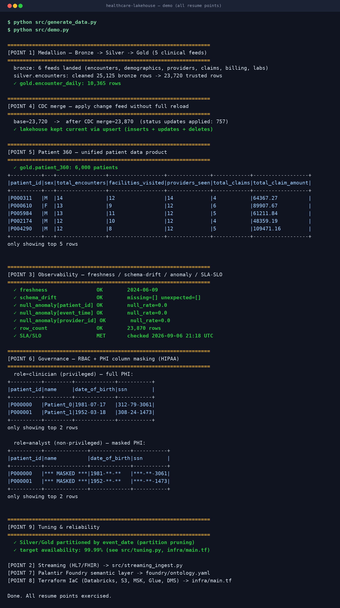
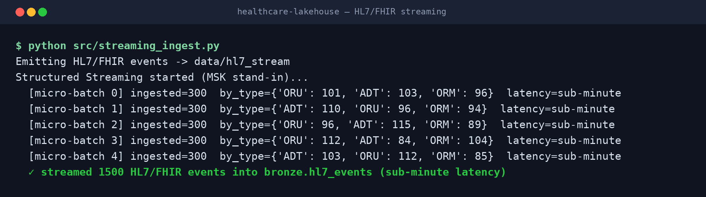

<h1 align="center">Sai Karna</h1>
<h3 align="center">Lead Data Engineer</h3>

<b>AWS · Databricks Lakehouse · Real-Time Streaming · Data Governance</b>

  
  
  

## Professional Summary

Lead Data Engineer with 12+ years designing, building, and modernizing enterprise data platforms across healthcare, banking, retail, insurance, and telecom. Currently leading the clinical data lakehouse on AWS Databricks at HCA Healthcare, an enterprise of 190 hospitals and approximately 2,500 sites of care; previously built real-time fraud and payments pipelines on AWS at First Citizens Bank and a GCP retail analytics platform at Costco. Deep hands-on expertise in Spark/PySpark, Delta Lake, Kafka (Amazon MSK) and Structured Streaming, CDC, dimensional modeling, data observability, and governance (Unity Catalog, Lake Formation) for regulated data including HIPAA-protected PHI and fraud/AML datasets. Career progression from Informatica/Oracle data warehousing into cloud-native lakehouse engineering; mentors engineers and sets platform standards for architecture, governance, and pipeline design.

## Technical Skills

**Cloud & Lakehouse:** AWS (S3, Glue, DMS, EMR, Kinesis, Lambda, Step Functions, EventBridge, Athena, Lake Formation, CloudWatch), Databricks, Delta Lake, Unity Catalog, Apache Iceberg, Medallion Architecture

**Processing & Streaming:** Apache Spark, PySpark, Spark Structured Streaming, Amazon MSK (Kafka), Amazon Kinesis, Change Data Capture (CDC), event-driven pipelines, exactly-once and idempotent processing

**Languages:** Python, SQL, PL/SQL, T-SQL, UNIX Shell Scripting

**Warehousing & Modeling:** Snowflake (Snowpipe, Streams, Tasks), BigQuery, Dimensional Modeling (Star/Snowflake Schema, SCD Type 1 & 2), Data Marts, Patient/Provider 360 modeling

**Governance & Reliability:** RBAC, column masking, data lineage, metadata management, data quality, observability (freshness, schema drift, anomaly detection, SLA/SLO alerting), HIPAA/PHI controls

**Orchestration & Semantic Layer:** Apache Airflow (Cloud Composer), Palantir Foundry (Ontology, Pipeline Builder), Looker (LookML)

**Additional Experience:** GCP (BigQuery, Dataflow, Pub/Sub, Cloud Composer, Dataproc), Azure (Data Factory, SQL Database, Blob Storage), Informatica PowerCenter, SSIS, dbt, Power BI, Control-M, Oracle, SQL Server

**DevOps & Practices:** Terraform (Infrastructure as Code), Git, CI/CD, Agile Scrum, Jira, production support, performance tuning

**Domains:** Healthcare (HL7, FHIR, HIPAA), Banking (Fraud, AML, Payments), Retail (Merchandising, Supply Chain), Insurance (Claims, Underwriting), Telecom (Billing, CDR)

## Professional Experience

### HCA Healthcare Inc. — Nashville, TN
**Lead Data Engineer** · *Mar 2023 – Present*
*Clinical & Enterprise Data Platform on AWS Databricks*

- Lead the design and build of HCA's clinical data lakehouse on AWS Databricks for an enterprise of 190 hospitals, ~2,500 sites of care, and ~47M annual patient encounters, consolidating EMR/EHR, claims, billing, lab, and provider feeds previously siloed across facilities into governed Bronze/Silver/Gold Delta Lake layers that downstream analytics teams query directly.
- Re-architected HL7/FHIR and patient-monitoring ingestion from nightly batch to streaming on Amazon MSK and Databricks Structured Streaming, cutting clinical-event latency from next-day to sub-minute for time-sensitive clinical dashboards.
- Designed and implemented the platform's data observability layer (freshness, schema-drift, lineage, and anomaly checks with SLA/SLO alerting) after silent pipeline failures had surfaced as incorrect figures in reports; pipeline breaks are now detected before they reach consumers.
- Implemented CDC replication from core clinical and financial source systems using AWS DMS and Glue, keeping the lakehouse current without full reloads and reducing the window in which analytics ran on stale data.
- Modeled a Patient 360 data product unifying encounters, demographics, claims, and provider interactions into a single consistent patient view used by care-coordination and outcomes teams.
- Established data governance and PHI controls with Unity Catalog and AWS Lake Formation (RBAC, lineage, column masking), maintaining HIPAA compliance as additional teams onboarded to the platform.
- Published governed patient and provider data products through Palantir Foundry (Ontology, Pipeline Builder), giving analysts a trusted semantic layer for self-service in place of raw tables.
- Provisioned and managed platform infrastructure with Terraform (Infrastructure as Code) — Databricks workspace and cluster resources, S3 storage, IAM roles, and streaming/ingestion services (MSK, Glue, DMS) — so environments are versioned in Git and reproducible across dev, test, and production.
- Tuned Databricks cluster configurations, Delta Lake partitioning, and Spark execution plans to reduce compute cost and query times while maintaining 99.99% availability on production workloads.
- Mentor the data engineering team and own the platform's standards for architecture patterns, governance, and pipeline design.

**Environment:** *AWS, Databricks, Delta Lake, Unity Catalog, Lake Formation, PySpark, Python, SQL, S3, Glue, DMS, Amazon MSK (Kafka), Spark Structured Streaming, CloudWatch, CDC, Medallion Architecture, HL7, FHIR, Palantir Foundry, Terraform, Git, Jira, Agile Scrum.*

---

### First Citizens Bank — Cary, NC
**Senior Data Engineer** · *Sep 2020 – Feb 2023*
*Real-Time Payments & Fraud Analytics Platform*

- Built the real-time fraud and payments data platform on AWS, unifying ACH, wire, card, and digital-banking activity (150M+ events/month) into a single event stream consumed by fraud and risk teams.
- Engineered the near-real-time fraud-scoring pipeline on Amazon Kinesis, PySpark, and EMR, meeting a 2-minute SLA from transaction event to risk decision.
- Enriched payment events in-stream with account history, geolocation, and device signals, providing the contextual features behind improved fraud-detection accuracy.
- Implemented exactly-once and idempotent write patterns across the streaming path, eliminating duplicate transactions from fraud logic and financial reporting.
- Delivered fraud, AML, and customer-risk data marts in Snowflake using Snowpipe, Streams, and Tasks for incremental loads, removing analysts' dependency on nightly batches.
- Adopted Apache Iceberg on the S3 data lake to manage schema evolution as source formats changed, preventing the breakages experienced with rigid table formats.
- Maintained core-banking data currency with AWS DMS CDC and tuned large Spark jobs to sustain throughput as volumes grew, achieving 99.95% availability.
- Defined AWS infrastructure for the streaming platform in Terraform — S3 buckets, IAM policies, Kinesis streams, EMR and Glue resources — replacing manual console setup with version-controlled, repeatable deployments.
- Led the migration of legacy banking workloads to AWS and mentored engineers on PySpark, streaming, and data modeling.

**Environment:** *AWS, S3, Glue, DMS, Lambda, EventBridge, Athena, Kinesis, EMR, Step Functions, CloudWatch, Snowflake (Snowpipe, Streams, Tasks), Apache Iceberg, PySpark, Python, SQL, CDC, Dimensional Modeling, Terraform, Git, Jira, Agile Scrum.*

---

### Costco — Seattle, WA
**Senior Data Engineer** · *May 2017 – Aug 2020*
*Retail Merchandising, Inventory & Supply Chain Analytics*

- Built Costco's retail analytics platform on GCP, consolidating POS, inventory, supplier, and merchandising data from 800+ warehouses for merchandising and supply-chain teams.
- Ingested 50M daily transactions through Pub/Sub and Dataflow, providing near-real-time inventory and sales visibility in place of day-old snapshots.
- Delivered self-service analytics through Looker (LookML) semantic models, enabling merchandising and planning teams to answer KPI questions (turnover, promo lift, fill rate) without engineering tickets.
- Optimized heavy BigQuery workloads with partitioning, clustering, and materialized views, cutting query times and compute cost on multi-terabyte datasets.
- Built demand-forecasting datasets from historical sales, seasonality, and promotions, and inventory-intelligence datasets that reduced stockout incidents by 22%.
- Orchestrated pipelines with Apache Airflow (Cloud Composer) and added SLA monitoring, ensuring daily merchandising and pricing decisions ran on fresh data.

**Environment:** *GCP, BigQuery, Cloud Storage, Dataflow, Pub/Sub, Dataproc, Cloud Composer (Airflow), Python, PySpark, SQL, Apache Beam, Looker (LookML), Dimensional Modeling, Git, Jira, Agile Scrum.*

---

### Brown & Brown, Inc. — Daytona Beach, FL
**ETL Developer** · *Oct 2015 – May 2017*
*Insurance – Claims, Underwriting & Reconciliation*

- Integrated policy administration, claims, billing, and underwriting systems into a central insurance analytics repository with Informatica PowerCenter, processing millions of transactions daily.
- Built metadata-driven ETL so that new sources followed a standard ingestion pattern rather than one-off mappings, reducing build time for each new feed.
- Automated reconciliation across policy, billing, and claims data, surfacing premium leakage the business had not been detecting and reducing reporting variances.
- Delivered underwriting and actuarial datasets with Power BI dashboards for loss-ratio and risk-exposure analysis.
- Developed SSIS packages and T-SQL stored procedures to load SQL Server reporting marts and stage data for the Azure SQL Database migration, complementing the Informatica workflows for SQL Server-based sources.
- Supported the migration of reporting workloads to Azure (Data Factory, SQL Database, Blob Storage) and tuned Informatica mappings to shorten nightly batch windows.

**Environment:** *Informatica PowerCenter, SSIS, Oracle 11g, SQL Server, Azure Data Factory, Azure SQL Database, Azure Blob Storage, PL/SQL, T-SQL, Metadata-Driven ETL, Power BI, Control-M, Agile.*

---

### Cox Communications — Atlanta, GA
**Data Warehouse Engineer** · *Feb 2013 – Sep 2015*
*Telecom – Subscriber, Billing & Customer Analytics*

- Built the subscriber and billing data warehouse on Oracle 11g, consolidating billing, payments, and network usage from multiple telecom systems for enterprise reporting.
- Developed Informatica and SSIS ETL processing Call Detail Records and billing feeds (tens of millions of events monthly) into star/snowflake models with SCD Type 1/2 for historical tracking.
- Tuned Oracle PL/SQL, indexes, and partitions to cut batch run times and keep loads within the reporting window.
- Delivered the datasets behind churn, ARPU, and retention reporting used by customer-care and marketing teams.

**Environment:** *Oracle 11g, SQL Server, Informatica PowerCenter, SSIS, PL/SQL, T-SQL, Star & Snowflake Schema, SCD Type 1 & 2, Call Detail Records (CDR), UNIX Shell Scripting, Control-M, Agile.*

## 🚀 Projects — hands-on demos of the patterns above

Built on **synthetic data** (no PHI / proprietary code). Fully runnable, with live-run screenshots.

### 🥇 Healthcare Clinical Data Lakehouse (PySpark) — *mirrors my HCA role*

Recreates **every responsibility from my HCA Lead Data Engineer role**, each mapped to real code:

| # | Resume responsibility | Implemented in |
|---|----------------------|----------------|
| 1 | EMR/EHR, claims, billing, lab & provider feeds → **Bronze/Silver/Gold** | `src/medallion.py` |
| 2 | **HL7/FHIR** batch → **streaming** (MSK + Structured Streaming), sub-minute | `src/streaming_ingest.py` |
| 3 | **Observability** — freshness, schema-drift, lineage, anomaly, SLA/SLO | `src/observability.py` |
| 4 | **CDC** merge (DMS + Glue) — current without full reloads | `src/cdc_merge.py` |
| 5 | **Patient 360** data product | `src/patient360.py` |
| 6 | **Governance & PHI masking** (Unity Catalog / Lake Formation, HIPAA) | `src/governance.py` |
| 7 | **Palantir Foundry** (Ontology, Pipeline Builder) | `foundry/ontology.yaml` |
| 8 | **Terraform** IaC (Databricks, S3, MSK, Glue, DMS) | `infra/main.tf` |
| 9 | **Tuning** — partitioning, Delta OPTIMIZE, 99.99% availability | `src/tuning.py` |

**Live run — all points in one demo:**

**HL7/FHIR streaming — sub-minute ingestion:**

`PySpark` · `Delta / Medallion` · `Structured Streaming` · `CDC` · `Patient 360` · `Governance / PHI masking` · `Palantir Foundry` · `Terraform` · `pytest`

### 🥈 Real-Time Fraud Detection (Spark Structured Streaming) — *mirrors First Citizens*
Streaming scorer flagging every transaction **ALLOW / REVIEW / BLOCK** in real time, micro-batch by micro-batch. · `Spark Streaming · foreachBatch · pytest`

### 🥉 Retail Analytics (PySpark) — *mirrors Costco*
100K rows across 40 warehouses → KPIs, top-product ranking, 7-day moving average. · `PySpark · Window functions · pytest`

### 🏅 Insurance Reconciliation (PySpark) — *mirrors Brown & Brown*
Reconciles policy ↔ billing ↔ claims and detects **premium leakage**. · `PySpark · multi-source joins · pytest`

### 🏅 Telecom Billing & Churn Warehouse (SQL) — *mirrors Cox*
Star schema → **ARPU, churn & retention** marts. · `SQL · Star Schema · Dimensional Modeling`

## Education

**Master of Science, Computer & Information Sciences** — Southern University and A&M College · *2011 – 2013*

**Bachelor of Engineering, Computer Science & Engineering** — Saveetha Engineering College · *2007 – 2011*

## Certifications

- AWS Certified Data Engineer – Associate
- Google Cloud Professional Data Engineer
- Microsoft Certified: Azure Data Engineer Associate (DP-203)
- Palantir Foundry Certified

<i>📫 <a href="mailto:saiexpo8899@gmail.com">saiexpo8899@gmail.com</a> · 📞 +1 (530) 255-4049 · 🌐 <a href="https://saik85.github.io/">saik85.github.io</a></i>

